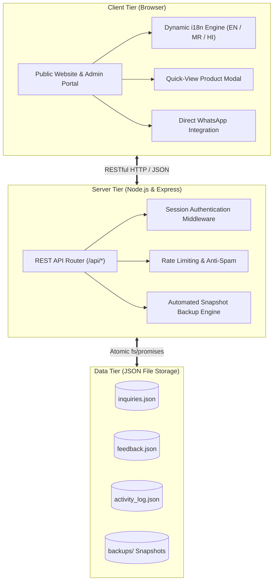

# Bharti Green Tech 🌿
> **Solution for Better Life** — Premium Organic Biotechnology & Sustainable Agricultural Solutions

[](LICENSE)
[](https://nodejs.org/)
[](https://expressjs.com/)
[](#-multi-lingual-experience)

**Bharti Green Tech** is a full-featured, responsive multi-lingual agricultural portal and administrative management system. It showcases bio-fertilizers, bio-fungicides, bio-pesticides, and soil conditioners, provides click-to-chat WhatsApp consultations, and offers a secure governance dashboard for inquiry management and testimonial moderation.

---

## 🏗️ System Architecture

The application follows a clean 3-tier decoupled architecture:



---

## 🛠️ Technology Stack

| Layer | Technologies & Tools | Purpose |
| :--- | :--- | :--- |
| **Frontend** | HTML5, Semantic Elements | Structure and accessibility |
| **Styling** | Vanilla CSS3, Custom Properties, Glassmorphism, Flexbox/Grid | Responsive styling & smooth animations |
| **Logic & i18n** | Vanilla JavaScript (ES6+), Dynamic `Object.defineProperties` | Client interactivity & reactive multi-lingual switching |
| **Backend** | Node.js, Express.js | High-performance REST API & static file serving |
| **Persistence** | JSON Flat-File Engine (`fs/promises`) | Lightweight, self-contained data storage with zero DB setup |
| **Security** | Rate Limiting, Soft-Delete Pipeline, Session Auth | Anti-spam protection & safe data governance |
| **Asset Engine** | Python, OpenCV, PyMuPDF | Studio-grade transparent product asset extraction (600x600 PNG) |

---

## ✨ Highlights & Features

* 🌐 **Multi-Lingual Experience**: Instant dynamic switching across **English**, **मराठी (Marathi)**, and **हिंदी (Hindi)** with zero page flicker.
* 📦 **Interactive Product Catalog**: Clean transparent product photography, formulation filters, and instant Quick-View details modal.
* 💬 **WhatsApp Consultation**: Pre-filled one-click WhatsApp chat links for immediate farmer support.
* 🛡️ **Admin Control Panel**:
  * Farmer Stories & Testimonial Moderation pipeline (Approve / Hide / Restore).
  * Double-submission protected Inquiry management.
  * Two-stage **Trash Bin** with automated snapshot backups prior to permanent deletion.
  * Audit Activity Log recording administrative operations.

---

## 📦 Product Range

| Category | Key Products | Formulations |
| :--- | :--- | :--- |
| **Bio-Fertilizers** | Urva N, Urva P, Urva K, Urva Potash (25kg), Urva Combo Jaivik, Urva Spurad | Liquid (1L/5L), Granular (25kg Bag), Powder |
| **Growth Boosters** | Urva Carbon, Urva Urja, Urva Microbes, Urva P2K2 (ICAR Patented) | Liquid, Bucket (2kg/4kg), Box (1kg) |
| **Bio-Fungicides** | Urva Vajra, Urva Ayudh, Urva Sudarshan, Urva Ampelo, Urva Wilto, Urva Fungo | Liquid (1L/5L), Bucket (2kg/4kg) |
| **Bio-Pesticides** | Urva Shone, Urva Rakshak, Urva Rudra, Urva Dhanush, Urva Pinaca, Urva BVM, Urva Nemato | Liquid (250ml-5L), Granular (25kg), Bucket |
| **Soil Health** | Urva Compost Culture, Urva Slurry Culture, Urva D-Compost | Granular (25kg), Liquid Duo (1L) |
| **Seed Processing** | Urva AZO, Urva Rhizo | Pouch / Granular |

---

## 🚀 Quick Start & Installation

### Prerequisites
* **Node.js** (v16.0.0 or higher)
* **npm** (v8.0.0 or higher)

### 1. Clone & Install
```bash
git clone https://github.com/aditiyelpale20/greentech.git
cd greentech
npm install
```

### 2. Run the Application
```bash
npm start
```

### 3. Access Portals
* **Public Website**: `http://localhost:3000/index.html`
* **Product Catalog**: `http://localhost:3000/products.html`
* **Admin Dashboard**: `http://localhost:3000/admin.html`

> [!NOTE]
> For administrative access, credentials are configured securely on your private server environment.

---

## ☁️ Deployment Guidelines

The codebase is self-contained with dynamic relative endpoints, making it ready for instant cloud deployment:

* **Node.js Cloud Hosts (Render, Railway, Heroku)**:
  * Set Build Command: `npm install`
  * Set Start Command: `npm start`
* **Nginx / Apache Reverse Proxy**:
  * Forward HTTP traffic on port `80`/`443` to local port `3000`.

---

## 📁 Repository Structure

```text
├── assets/
│   ├── css/style.css            # Central responsive stylesheet & modal transitions
│   ├── js/main.js               # Header, navigation & UI controllers
│   ├── js/products.js           # Unified product catalog with dynamic i18n getters
│   └── products/                # 42+ High-res transparent product PNGs (600x600)
├── backups/                     # Auto-generated JSON database snapshots
├── db.js                        # JSON database helper with atomic file locking
├── server.js                    # Express API server & routes
├── i18n.js                      # Core translation engine
├── translations.js              # Central translation dictionary (EN, MR, HI)
├── languageManager.js           # DOM language scanner & selector sync
├── index.html                   # Public homepage
├── products.html                # Product catalog with Quick-View modal
├── farmer-stories.html          # Farmer reviews & submission form
├── contact.html                 # Inquiry contact form
└── admin.html                   # Secure administrative control panel
```

---

## 📞 Contact & Inquiries

* **Company**: BHARTI GREEN TECH
* **WhatsApp / Phone**: +91 90497 47555
* **Email**: info@bhartigreentech.com
* **Plant**: Gat No. 629, At Post Sokasan, Tal-Man, Satara, Maharashtra - 415508
* **Corporate Office**: Prakash Resi., 702, Sector 10E, Road Pali, Navi Mumbai, Maharashtra


